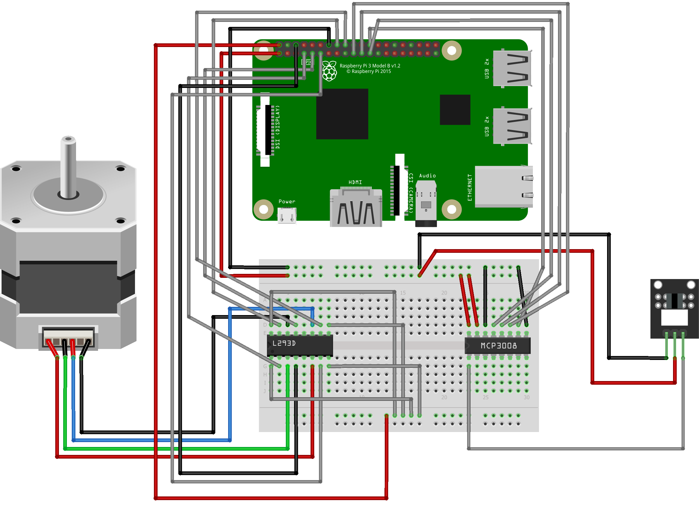

= How to build a motorized slider
Doc Writer <doc.writer@asciidoctor.org>
v0.1.0, 2020-08-01
:toc: left

== Build your own slider

With the help of SliDIY it is made possible to easily build your own motorized slider.
SliDIY is a web application which controls the movement of your slider.

=== Hardware list

https://www.amazon.de/gp/product/B06Y46H989/[Camera Slider] +
https://www.amazon.de/gp/product/B00PNEQKC0/[Stepper Motor] +
https://www.amazon.de/Raspberry-Pi-7-Inch-Screen-Display/dp/B014WKCFR4[Touchscreen (optional)] +
https://www.amazon.de/gp/product/B07JGXG7S2/ref=ppx_yo_dt_b_asin_title_o00_s00[Timing Belt with Accessories] +
https://www.amazon.de/Youmile-Schrittmotortreiber-Controller-TREIBER-Rundloch/dp/B0817HXMBM/ref=sr_1_5[L293D] +
https://www.amazon.de/Adafruit-MCP3008-8-Channel-Interface-Raspberry/dp/B0722FJRSQ/ref=sr_1_4[MCP3008] +
https://www.amazon.de/MissBirdler-Lichtschranke-Optical-TCST2103-Raspberry/dp/B01N96C89L/ref=sr_1_8[Optical Endstop]

=== Breadboard

=== Pinouts

https://media.discordapp.net/attachments/793866846948163635/793868521506734100/GPIO-Pinout-Diagram-2.png[Raspberry Pi] +
https://media.discordapp.net/attachments/793866846948163635/813754097022926878/ByvIYbYymtI3JKiwxAiWJJaRGXuCAHvD6U6x39VU2MlTiQmrOnyuxKH8cXF57D7fvXf8nvpG6fhgE8Cp1mUROIo7R3k0EGGWSQQQ.png[MCP3008] +
https://i.stack.imgur.com/xg8gz.png[L293D]

=== Software installation

Install https://www.raspberrypi.org/software/[Raspberry Pi OS] using Raspberry Pi Imager

First follow the instruction of the Raspberry Pi

Then unlock ssh in the raspi-config

``raspi-config`` +
In this menu change to the tab "Interfacing Options" and enable the option "SSH". After this you need to reboot your
your Raspberry Pi.

On the Raspberry Pi:

Download & extract the latest *release.zip*

Run the *configure.sh* 

  chmod +x script-name-here.sh
  ./configure.sh

Enable spi on the rpi +
* *Menu* > *Preferences* > *Raspberry Pi Configuration* > *Interfaces* Tab
* set SPI to “Enabled”

Reboot the Raspberry Pi
  
Run app

  python slidiy.py
  
Go to localhost:5000

=== 3D-Case

We used https://www.tinkercad.com/[Tinkercad] for modeling our 3D-Case since it is made for people who have
never touched a 3D-modeling software. Tinkercad is a simple web-based modeling-tool. You have to export your 3d-model as a *STL-file* for the 3d-printing.
There are no strict rules on how to design your case, so model it the way you want or download our https://github.com/franziskusehmeir/SliDIY/blob/main/box.stl[model]!

=== Sources
https://tutorials-raspberrypi.de/raspberry-pi-schrittmotor-steuerung-l293d-uln2003a/ +
https://tutorials-raspberrypi.de/raspberry-pi-mcp3008-analoge-signale-auslesen/

